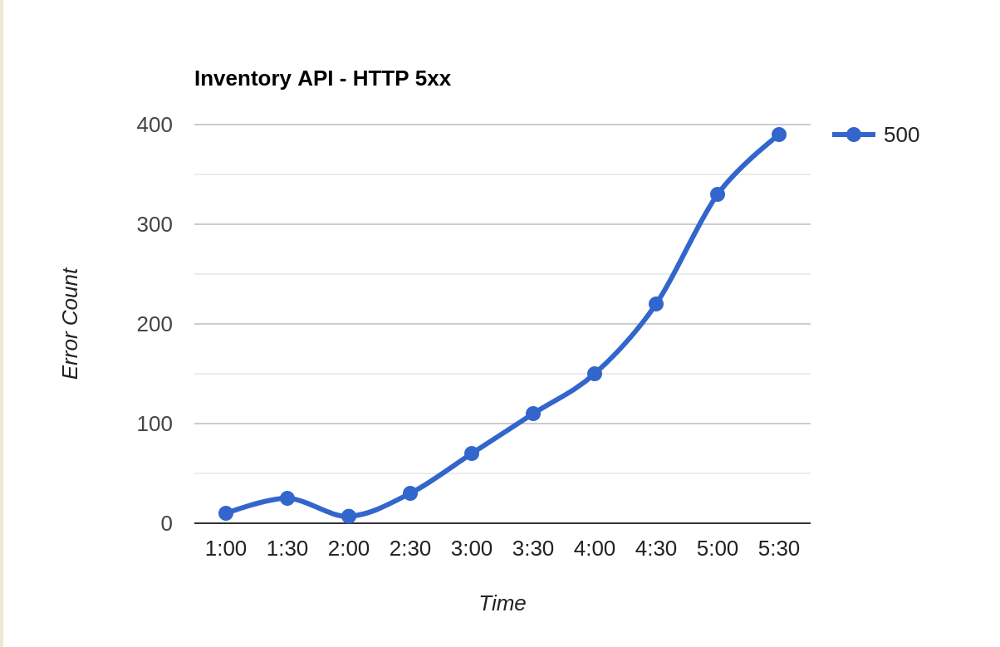

# SRE Summit Canada 2024 - 
# Incident Management Workshop - Part Two
# Incident resolution and RCA

Based on the Incident Management PRocess and the background information ( refer [README](README.md)), create documents for the checklist items given below.  An example items is added in every checklist for reference 

The ecommerce company is facing a business disruption.  On a busy business day, you get the following alert

```
CRITICAL: Average number of checkouts are down by 7% in last one hour
```

* Average number of checkouts is a global metric that is tracked as it is indicative of a critical business function.  This metric is emitted by the checkout backend api service.

* The customer traffic is normal and has not deviated much from the same time frame of previous days

The checkout backend service emits standard HTTP metrics as well, and one of the dashboards were looking as follows:


Further investigation through the checkout API logs showed the following error in high frequency

```
GetInventory call failed - Received HTTP 500 from Inventory API
```

# Stop!

> * Now it is confirmed from the graphs and logs that there is a real incident with high impact going on.  
> * Before continuing the investigation, you need to declare and log the incident.  
> * You also need to communicate about the issue.
> * Get additional help if necessary in this process


## 2a: Open a ticket in the incident management queue.  

Think of what all details will be added into the incident ticket, including title, summary, severity, TTD, TTA and any other relevant details.  Instead of ticket, write them down as list of key value pairs

## 2b: Communicate to the leadership

Draft an email with all necessary details as free form text.


# Investigation Continues…

The checkout API has a hard dependency on inventory to place the order.  The partial architecture diagram that involves checkout API and inventory API is as follows:


The inventory data is stored in MySQL. To speed up reads, an intermediate cache layer of redis is used.  Only if the information is not available in redis, the MySQL DB will be queried

The inventory API HTTP 5xx graph for the same time frame is 



The Inventory API logs show the following message in high numbers:

```
Lost connection to server during query
```

The mysql metrics dashboard shows the following:


The increased connections to MySQL probably has something to do with the Redis Cache.  The following Redis graphs are interesting:


2c: Find the root cause

This should provide you with a reasonable amount of debugging info to go on with.  Use your experience as an SRE, make reasonable assumptions about the architecture and the problem at hand and figure out possible root causes for this.

2d: Figure out remediation steps

Once the root cause is found, figure out what can remediate the issue.  Once done the incident is marked resolved ( pending postmortem )

2e: Communicate to the leadership

Once the issue is stable/remediation steps are found out, send out another communication to the leadership

2f: Write a postmortem report

|||
|---|---|
|Title|                                                        |
|Date||
|Authors||
|Status
|Summary
|Impact
|Root cause
|Trigger
|Resolution
|Detection
|Action Items
|Lessons learned
|Timeline
|Support information and artifacts


### Conclusion

This brings us to the end of the workshop.  A lot of details about infrastructure and the incident itself is left to reasonable and logical guesswork.  That way there are more chances of getting slightly different exercise outcomes based on your past experience and thought process.


Thank you!

Safeer C M

https://safeer.sh
