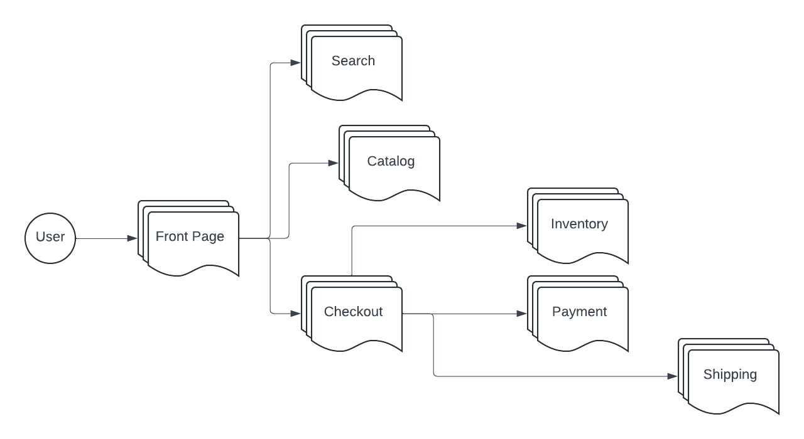

# SRE Summit Canada 2024 
# Incident Management Workshop

## Background

Consider you are SRE for an e-commerce company that serves customers across the globe.  Let us go through the steps of setting up the incident management process.

Assume that you already have basic maturity in observability and have implemented component/service level observability with metrics and some logging.  You also have a basic alert management system and a bug tracking/ticketing system. 

You don’t have a dedicated IM team, you only have a centralized SRE team.

The high level architecture diagram of the infrastructure is given below.  The diagram only shows the high level software domains ( group of components that serve a business function ).  

There will be a number of components under each domain - L4/L7 LBs, Proxies, APIs, RDBMS, Document DBs, Message Brokers etc.    Make reasonable and logical assumptions on what are the components involved in each domain. 

Each domain will typically be owned by a team or a business unit depending on the size of the software development division of the company.  It is common for multiple sub teams within a team/BU to own one or more components within that domain.  On the contrary, in small companies, there will be only a handful of teams to deal with all these domains/components.
