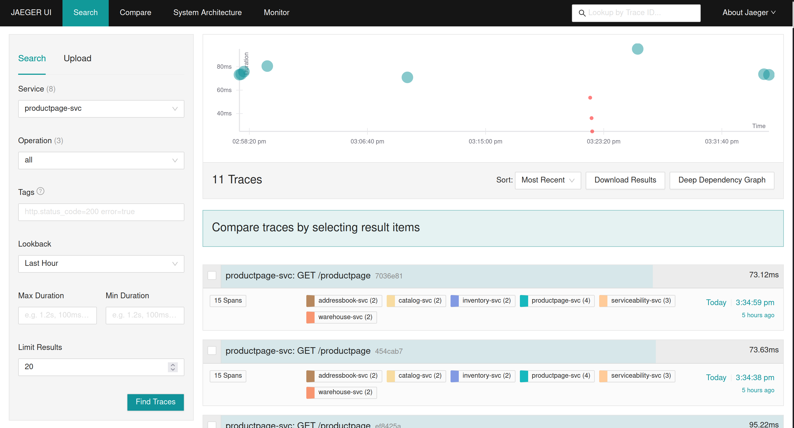
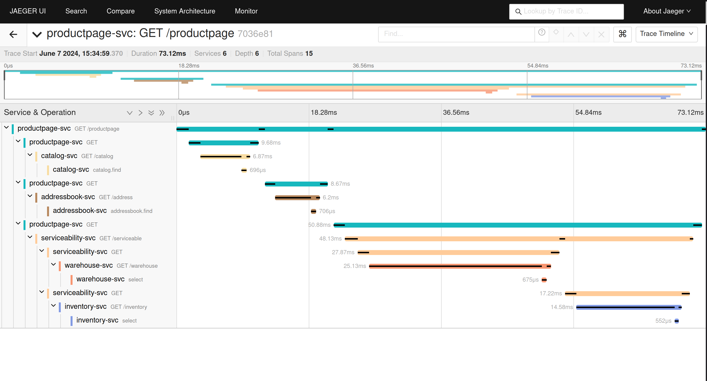
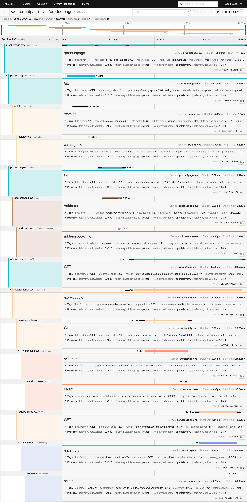

# Install MySQL and MongoDB

You can install both using your OS's native installations methods

OR

Use following docker containers

https://hub.docker.com/_/mysql

https://hub.docker.com/_/mongo


Make sure that

mysql server is listeling on port 3306

AND

mongodb is listening on 27017

# Setup Jaeger All In One Container
```
docker run -d --name jaeger \
  -p 4317:4317  \
  -p 16686:16686 \
  jaegertracing/all-in-one:1.49
```

```
git clone git@github.com:safeercm/sre-summit-canada-2024.git
```

```
cd otel-talk

python3 -m venv .venv2
source .venv2/bin/activate

pip install -r requirement.txt

opentelemetry-bootstrap -a install
```

# Update the config.py file

This file has configuration of all microservices and datastores, entries are self explanatory.  Make sure mysql username and passwords are updated correctly. ( check notes on local DNS names below )

## Local DNS names

The microservice endpoints are given local dns names using /etc/hosts configuration on my Linux host.  If you are using a different OS, plese use the host file equivalent/service.  If you dont want to use DNS names, replace them with locathost/127.0.0.1

My /etc/host is as follows

```
## SRE CAN 2024 Demo
#

127.0.0.1 addressbook.mongo.sre
127.0.0.1 addressbook.api.sre

127.0.0.1 catalog.mongo.sre
127.0.0.1 catalog.api.sre

127.0.0.1 inventory.mysql.sre
127.0.0.1 inventory.api.sre

127.0.0.1 warehouse.mysql.sre
127.0.0.1 warehouse.api.sre

127.0.0.1 serviceable.api.sre

127.0.0.1 productpage.api.sre

```

# Create DBs, Tables, Collections and load sample data to mysql and mongo

```

python3 setup-mysql.py

python3 setup-mongo.py

```

# Start supevisord to run all microservices

There are 6 microservices involved, and we use supervisord to run all of them together.

```
supervisord -n
```

This will run supervisor on forground. If you want to run it in background, remove the `-n` option

All microservices as well as supervisord will create logs in the current directory.  To roubleshoot any issues, look for *.log files in the CWD.

# Query the product page API to verify

product page API is the entry point to the microservices.  

```
curl -s "http://productpage.api.sre:5000/productpage?user=safeer&id=10"|jq .
{
  "address": {
    "_id": "safeer",
    "city": "Bangalore",
    "pin": 560066
  },
  "product": {
    "_id": 10,
    "name": "MacBook Pro 13",
    "price": 250000
  },
  "serviceable": {
    "serviceable": "yes"
  }
}

```

If you see the above output, everything is working as expected, else check the microservice/supervisord logs / availability of mysql and mongo.

# Open Jaeger UI to view the traces

The jaeger UI is available at http://localhost:16686/search

From the `Services` drop down menu, select `productpage-svc` and press the `Find Traces` Button.  Click the top one in the list of traces that will display on the right side of the pane.



The new page will show the trace in a timeline view




The expanded view of the trace with all 15 spans



